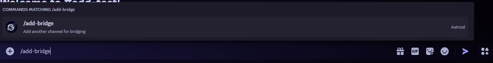

# Adding more channels

Astroid theoretically supports infinite channels to bridge. This small guide shows you how to do this. No worries, its really easy!

## Step 1: Add channel on Discord

Go into the Discord channel you want to add and run the <mark style="color:purple;">`/add-bridge`</mark> command.\
_(Note: Channels you run the add-bridge commands in will be bridged. Please only run the add-bridge command in the correspondig channel on other platforms. )_

<details>

<summary>Disclaimer for the Astroid beta Discord bot</summary>

The Astroid Beta bot has additional options like <mark style="color:purple;">`guilded-channel`</mark> or <mark style="color:purple;">`guilded-webhook`</mark>. \
These can be **safely left blank** and are only for adding a channel of another platform with a channelId and Webhook-URL. If you are inserting values to this command, **make sure the channel field containing an ID and the webhook field is containing a webhook url**.

</details>

<figure><figcaption></figcaption></figure>

After the channel got succesfully added, you should recieve a message like this:

<figure><figcaption></figcaption></figure>

## Step 2: Add channel on other platform/s

Hop over to your other platform/s and excute the following command with thee provided syntax.\
_(Note: Channels you run the add-bridge commands in will be bridged. Please only run the add-bridge command in the correspondig channel on other platforms. )_

```
a!add-bridge YOUR-DISCORD-SERVER-ID
```

## Aaand done again!

Your channel was added and should now being bridged too!
