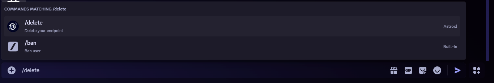
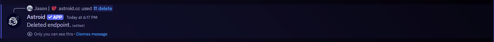
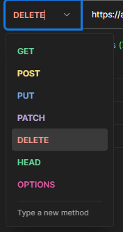

# Deleting your endpoint

You want to delete your endpoint (bridge)? Thats sad to hear :( Do you want to give us some feedback why? -> Join our Support Servers <mark style="color:red;">\[ADD LINK]</mark>

## Option 1: via the Discord bot

You can delete your endpoint via a simple command.

<mark style="color:purple;">`/delete`</mark>

<figure><figcaption></figcaption></figure>

After succesful deletion you should receive a message like this:

<figure><figcaption></figcaption></figure>

## Option 2: via an API request

You can use our API sending a simple <mark style="color:purple;">`DELETE`</mark>-Request.\
For sending a request like this you could use a program like Postman ([https://www.postman.com/downloads/](https://www.postman.com/downloads/), no account needed) or any other program you prefer.\
_(Note: I am using Postman in the example screenshots.)_

<details>

<summary>cURL snippet</summary>

```shell
curl --location --request DELETE 'https://astroid.cc/delete/YOUR-DISCORD-SERVER-ID?token=YOUR-TOKEN'
```

</details>

### Step 1: Set the request to <mark style="color:red;">`DELETE`</mark>

<figure><figcaption></figcaption></figure>

### Step 2: Enter the API URL

Enter the following API URL and

* replace <mark style="color:yellow;">`YOUR-DISCORD-SERVER-ID`</mark> with your discord server id and
* replace <mark style="color:yellow;">`YOUR-TOKEN`</mark> with the token you got in the registering process\
  (Alternatively you can run the <mark style="color:purple;">`/generate-token`</mark> command on discord to get a new one)

```
https://api.astroid.cc/delete/YOUR-DISCORD-SERVER-ID?token=YOUR-TOKEN
```

### Step 3: Press Send

If you replaced and set everything correctly send the request. The API should respond instantly with a succesful response. E.g.:

```json
{
    "message": "Deleted."
}
```


## Option 3: Send us an E-Mail

You can also just write us an E-Mail and we do all the work for you!

### Email: [info@astroid.cc](deleting-your-endpoint.md#email-info-astroid.cc)

<details>

<summary>E-Mail template</summary>

Dear Astroid team,

i would like to delete my endpoint with the id <mark style="color:blue;">`ENDPOINT-ID`</mark>. The token is <mark style="color:blue;">`TOKEN`</mark>.

Best regards!

</details>


If you send us an E-Mail, please make sure the following information is contained:

* Stating that you would like to delete your endpoint
* Endpoint ID (usually the Discord Server ID)
* Astroid Token (You got this in the registering process or generate a new via the following discord bot command: <mark style="color:purple;">`/generate-token`</mark>)
* _**Optional**: Reason for deleting your endpoint. (We'd just like to know why, no necessity though ;) )_

## Done!

All your data is now deleted.
