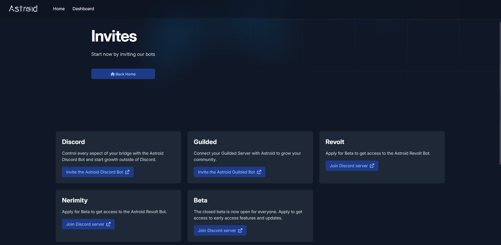
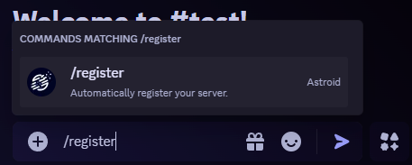
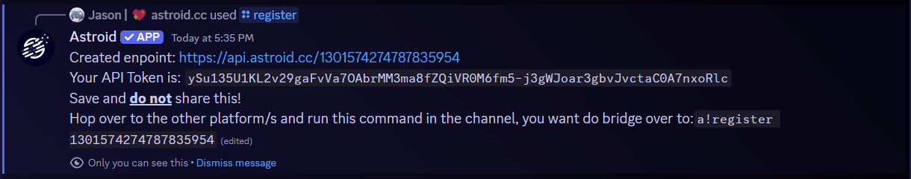

# First steps

To get started with Astroid you first need to set everything up. This Step-by-Step Guide will help you to setup everything.

Command provided for other platforms than Discord are **always** the same.\
\
_<mark style="color:yellow;">Note: For every command you use on discord you must have</mark> <mark style="color:yellow;"></mark><mark style="color:yellow;">**administrator**</mark> <mark style="color:yellow;"></mark><mark style="color:yellow;">permissions. On guilded there is no "administrator" permission, you'd need every permission to use Astroid's commands.</mark>_

## Step 1: Invite Astroid

**Head over to our Invite Page (**[**https://astroid.cc/invite**](https://astroid.cc/invite)**) and invite the Bots to you platforms**

<figure><figcaption><p>(Sample preview - actual site may vary)</p></figcaption></figure>

## Step 2: Register your server

**Run **<mark style="color:purple;">**`/register`**</mark>** on your Discord server** \
_(Note: Channels you run the register commands in will be bridged. Please only run the register command in a channel you want to bridge.)_

<figure><figcaption></figcaption></figure>

After sucessfull registration you should recieve a message like this:

<figure><figcaption></figcaption></figure>

## Step 3: Register other platforms

**Hop over to your other platform/s and run the command the bot provided.**\
_(Note: Channels you run the register commands in will be bridged. Please only run the register command in a channel you want to bridge.)_

```
a!register YOUR-DISCORD-SERVER-ID
```

## Done!

You should now be ready to go and messages should now bridge to the channel you ran the register commands in!\
**You want to add more channels?** -> [Next page](adding-more-channels.md)
